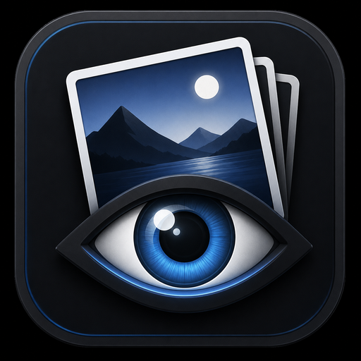
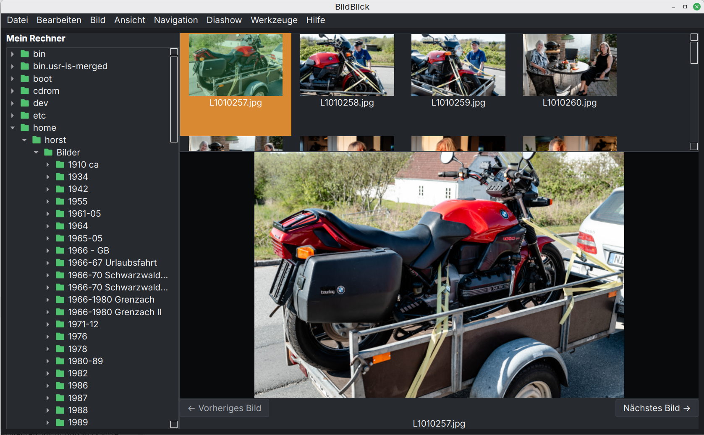

<p align="center">
  
</p>

# BildBlick



*BildBlick 1.19.0 unter Linux Mint und macOS*

**Version 1.19.0**

BildBlick ist ein schneller und komfortabler Bildbetrachter für Linux. Die Anwendung wurde unter Linux Mint entwickelt und getestet und verbindet eine übersichtliche Verzeichnisnavigation mit schnellen Vorschaubildern und praktischen Werkzeugen für die Bildverwaltung.

## Funktionen

- Verzeichnisbaum zur Navigation im Dateisystem
- Schnelle Vorschaubilder mit Metadaten-Cache
- Zoom, Originalgröße und Vollbildansicht
- Konfigurierbare Diashow
- Mehrfachauswahl von Bildern
- Größe der Vorschaubilder über einen Slider direkt unter der Vorschauliste
  verändern, mit Minus- und Plus-Schaltflächen sowie sofortiger, dauerhaft
  gespeicherter Anpassung
- Versteckte Dateien und Ordner bei Bedarf über **Ansicht** einblenden
- Kopieren, Ausschneiden und Einfügen, einschließlich Nemo-kompatibler Zwischenablage
- Sicheres Verschieben in den Linux-Papierkorb
- EXIF-Tooltips mit Abmessungen, Aufnahmedatum und ISO-Empfindlichkeit
- Einblendbares Bildinformationen-Panel mit kompakten Datei-, Kamera- und
  Aufnahmeinformationen sowie optionalen EXIF-, GPS- und IPTC-Details
- Farbschemata: System, Hell, Dunkel, Anthrazit und Warm
- Ruhige, klar gegliederte Galerie-Oberfläche mit großzügigeren Listen und
  dezenten Auswahlflächen
- Flexible Vorschaubildpositionen oben, links, rechts oder ausgeblendet,
  einschließlich Wiederherstellung der zuletzt sichtbaren Position
- Schnellschalter für Vorschaubilder, Details und Vollbild sowie eine gemeinsame
  untere Steuerleiste mit Auto-Hide und READY/BUSY/ERROR-Statusanzeige
- Modernisierte Informations-/EXIF- und Verzeichnisbereiche mit vollständiger
  Darstellung langer Metadatenwerte
- Kompakte Steuerzeile mit Thumbnail-Größe, Dateiname sowie Vor- und
  Zurücknavigation unter den Vorschaubildern – unter Linux und macOS
- Die Schaltflächen `‹` und `›` unter den Vorschaubildern wechseln zwischen
  Dateien.
- Der flachere Thumbnail-Regler schafft zusammen mit der entfernten unteren
  Navigationsleiste mehr Platz für das Hauptbild.
- Unter Linux können mehrere BildBlick-Instanzen gleichzeitig geöffnet werden.
- Duplikatfinder 2.0 mit mehreren Suchordnern, optionalen Unterordnern und sicherer Papierkorbauswahl
- Duplikatsuche nach gleichem Dateinamen, exakt gleichem Dateiinhalt sowie visuell gleichen oder ähnlichen Bildern per dHash

## Sprachen

- Deutsch
- Englisch
- Französisch
- Spanisch
- Ukrainisch

Die gesamte BildBlick-Oberfläche einschließlich Duplikatfinder, Druck, Export,
PDF und Hilfe ist in diesen Sprachen verfügbar. Die Sprachwahl wird dauerhaft
gespeichert.

## Duplikatfinder 2.0

- Mehrere Ordner mit optionaler Unterordnersuche
- Gleicher Dateiname, exakte Dateiidentität und visuelle Ähnlichkeit per dHash
- Sichere Papierkorb-Verwaltung: keine automatische Löschung, Auswahl und Bestätigung sind immer erforderlich

## PDF-Unterstützung

- PDF-Dateien erscheinen als Thumbnails; die erste Seite dient als Vorschau.
- PDFs öffnen direkt im normalen Bildbereich und behalten beim Zoom und bei
  „Bild auf Fenstergröße“ ihr Seitenverhältnis.
- Eine eigene, zentrierte Leiste unter der Dokumentansicht enthält
  „Vorherige PDF-Seite“, „Seite X von Y“ und „Nächste PDF-Seite“.
- Die PDF-Seitenleiste erscheint nur bei mehrseitigen PDFs, benötigt bei
  Bildern und einseitigen PDFs keinen Platz und bleibt im Vollbild sichtbar.
- `PageUp` und `PageDown` wechseln weiterhin PDF-Seiten.
- PDF-Dokumente funktionieren auch im Vollbild und können per Drag-and-drop
  geöffnet oder als lokale Datei-URL herausgezogen werden.
- Große mehrseitige PDFs werden bedarfsgerecht gerendert.
- Die erste Großansicht wird in geeigneter Auflösung gerendert und bei Bedarf
  nach dem Layout höher aufgelöst aktualisiert.
- Eingebettete PDF-Weblinks (`http`/`https`) öffnen den Standardbrowser;
  `mailto:`-Links öffnen den Standard-Mailclient einschließlich Empfänger und
  vorhandener Betreff-/Textparameter.
- Interne PDF-Links springen zur verknüpften Seite; über Links zeigt der Cursor
  eine Hand. Andere externe URL-Schemata werden nicht geöffnet.
- Unter Linux kann der Starter „BildBlick PDF“ als Standardprogramm für PDFs
  verwendet werden; er öffnet PDFs direkt im Vollbild.
- Auf macOS öffnet ein direkt im Finder angeklicktes PDF in einer großen
  Vorschau ohne Verzeichnis- und Dateileisten. Mit `Esc` oder über
  „Ansicht → PDF-Vorschau verlassen“ kehrt die normale Ansicht zurück.

```bash
BildBlick --fullscreen datei.pdf
xdg-mime default bildblick-pdf.desktop application/pdf
```

„Vorheriges Bild“ und „Nächstes Bild“ wechseln zwischen Dateien. „Vorherige
Seite“ und „Nächste Seite“ wechseln ausschließlich innerhalb der geöffneten
PDF. PDF-Bearbeitung, Textsuche und Textextraktion sind nicht enthalten.

## Drucken

- **Datei → Drucken …** öffnet den neuen WYSIWYG-Einzelbilddruck mit gemeinsamer PagePlan-/Renderer-Grundlage.
- **Datei → Mehrere Bilder drucken …** öffnet den WYSIWYG-Mehrbilddruck mit festen oder benutzerdefinierten Rastern.
- Mehrseitige Druckvorschau, PDF-Ausgabe und echter Druck verwenden denselben PagePlan.
- Einzelbild- und Mehrbildprofile, einschließlich Randlos-Profil, bleiben verfügbar.
- Kopf- und Fußzeilen unterstützen freien Text, Ordnername, Seitenzahl und Druckdatum.
- Für einen Kontaktabzug im Mehrbilddialog **Kontaktabzug** aktivieren und bei Bedarf Dateiname und Aufnahmedatum einblenden.
- Die Druckdialoge übernehmen den Light- oder Dark-Mode von BildBlick.

### Mehrere Bilder drucken

1. Bilder markieren.
2. **Datei → Mehrere Bilder drucken …** wählen.
3. Raster und Beschriftung wählen; für einen Kontaktabzug die Option **Kontaktabzug** aktivieren.
4. Vorschau prüfen.
5. **Weiter zum Druckdialog …** wählen.
6. Drucker oder **In Datei drucken** wählen.

## Unterstützte Dateiformate

BildBlick berücksichtigt JPEG (`.jpg`, `.jpeg`), PNG, WebP, BMP, GIF sowie TIFF (`.tif`, `.tiff`) und PDF (`.pdf`). Welche konkreten Bildvarianten dekodiert werden können, hängt zusätzlich von den in Pillow und Qt verfügbaren Bildformat-Plug-ins ab.

## Drag-and-drop

Bilddateien, PDFs und Ordner können aus Nemo direkt in BildBlick abgelegt werden. Bei einer Datei öffnet BildBlick ihren Ordner und zeigt die abgelegte Datei an. Mehrere Dateien aus demselben Ordner werden gemeinsam markiert; die zuerst abgelegte Datei wird angezeigt. Unterstützt werden die oben genannten Dateiformate.

### Bilder aus BildBlick herausziehen

Ein oder mehrere markierte Bilder oder PDFs lassen sich aus der Vorschauliste nach Nemo, auf den Schreibtisch oder als Anhang in ein Thunderbird-Verfassenfenster ziehen. BildBlick übergibt lokale Datei-URLs als Kopiervorgang; die Originale werden nicht verändert.

## Installation aus dem Quellcode

Voraussetzungen sind Python 3, `venv` und die üblichen Qt-Laufzeitbibliotheken der verwendeten Linux-Distribution.

```bash
git clone <repository-url>
cd BildBlick
python3 -m venv .venv
source .venv/bin/activate
python -m pip install --upgrade pip
python -m pip install -r requirements.txt
```

## Start mit Python

```bash
source .venv/bin/activate
python bildbetrachter.py
```

## macOS-App und eigenständige Anwendung bauen

Das Build-Skript verwendet die mitgelieferte PyInstaller-Spezifikation:

```bash
./build.sh
```

Unter macOS entsteht `dist/BildBlick.app`. Die App startet per Doppelklick, kann in den Programme-Ordner kopiert oder ins Dock gezogen werden und benötigt keine aktivierte virtuelle Umgebung. Auf anderen Plattformen entsteht `dist/BildBlick`. Build-Artefakte gehören nicht in das Git-Repository und werden separat als Release-Dateien veröffentlicht.

## Wichtige Tastenkürzel

| Taste | Funktion |
|---|---|
| `←` / `→` | Vorheriges beziehungsweise nächstes Bild |
| `PageUp` / `PageDown` | Vorherige beziehungsweise nächste Seite der geöffneten PDF |
| `Pos1` / `Ende` | Erstes beziehungsweise letztes Bild |
| `0` | Bild einpassen |
| `1` | Originalgröße |
| `F5` | Diashow starten oder stoppen |
| `F11` | Vollbild ein- oder ausschalten |
| `Strg+A` | Alle Bilder auswählen |
| `Strg+C` / `Strg+X` / `Strg+V` | Kopieren, Ausschneiden und Einfügen |
| `Entf` | Ausgewählte Bilder in den Papierkorb verschieben |
| `F1` | Hilfe öffnen |
| `I` | Bildinformationen ein- oder ausblenden |

## Sicherheit bei Dateivorgängen

BildBlick löscht Bilder nicht dauerhaft, sondern verschiebt sie mit Send2Trash in den Linux-Papierkorb. Vor Papierkorbaktionen ist eine Bestätigung erforderlich.

Die Duplikatsuche erkennt gleiche Dateinamen, bytegenau identische Dateien sowie visuell gleiche oder ähnliche Bilder. Exakte Treffer werden über Dateigröße, SHA-256 und einen blockweisen Inhaltsvergleich bestätigt. Visuelle Treffer verwenden einen EXIF-korrigierten dHash; sie werden nie automatisch für den Papierkorb markiert.

## Lizenz

BildBlick wird unter der [MIT-Lizenz](LICENSE) veröffentlicht. Hinweise zu verwendeten Bibliotheken enthält [THIRD_PARTY_NOTICES.md](THIRD_PARTY_NOTICES.md).
